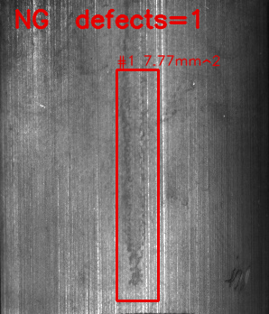
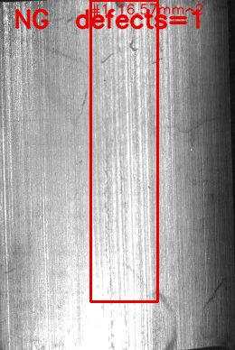
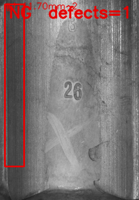
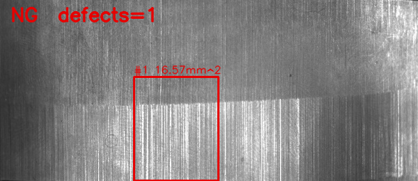

# C++ Machine Vision Inspection System POC

[](https://github.com/sungpyo9053/machine-vision-inspection-poc/actions/workflows/ci.yml)
[](LICENSE)
[](#)
[](#)

## 핵심 (Core)

**C++17 + OpenCV 4.x 룰베이스 표면 결함 검사 엔진** — `cpp/`.
자동차 도장면 / 금속 / 플라스틱 표면 이미지를 입력 받아 전처리, 결함 검출, 측정, OK/NG 판정, 결과 리포트(JSON / PNG / CSV) 생성까지 단일 `vision_inspector` CLI에서 완결됩니다.

```bash
./build/vision_inspector \
    --image data/sample_images/scratch_surface.png \
    --output data/results
# → result_scratch_surface.png + inspection_report_*.json + inspection_results.csv
```

핵심 엔진은 **Python 측에서 어떤 OpenCV 호출도 검사 목적으로 사용하지 않는** 단일 책임 구조이며, 후술하는 모든 확장 구현은 이 동일 CLI를 호출하는 얇은 wrapper입니다.

## 확장 구현 (Extensions, 모두 동일 CLI 호출)

| 영역 | 무엇 | 파일 |
| --- | --- | --- |
| 데모 UI | Streamlit (Python) | `app/streamlit_app.py` |
| 운영 HMI | C# WinForms (.NET 8) | `csharp_hmi/VisionInspectorHmi/` |
| 장비 인터페이스 | PLC/Camera/Robot in-memory 시뮬레이터 + 실 Modbus TCP 어댑터(pymodbus) | `interface/` |
| Dataset evaluation harness | 임의 라벨 폴더 → confusion matrix / per-category / 사이클 타임 | `scripts/evaluate_dataset.py` |
| 성능 측정 | `--benchmark N` (C++) + 일괄 wrapper (Python) | `cpp/src/main.cpp`, `scripts/benchmark_inspector.py` |
| 3D mini-demo | 합성 stereo + StereoSGBM disparity + depth-anomaly | `scripts/stereo_demo.py` |
| 단위 테스트 | C++ GoogleTest (FetchContent) + Python pytest | `cpp/tests/`, `tests/` |

## 1. 지원 직무 연관성

본 프로젝트는 **머신비전 검사 설비의 소프트웨어 구조를 재현한 POC**이며, 룰베이스 영상처리, 검사 판정, UI, 장비 인터페이스 시퀀스를 포함합니다.

| 채용 직무 요구 | 본 프로젝트 대응 |
| --- | --- |
| 머신비전시스템 구축 프로젝트 경험 | C++ OpenCV 엔진 + Camera/PLC/Robot 시뮬레이터 + Streamlit UI + C# WinForms HMI |
| 로보틱스 영상처리 알고리즘 개발 경험 | C++ 전처리 → contour → 측정 → 판정 파이프라인 + GoogleTest 단위 테스트 |
| 카메라/로봇/PLC 인터페이스 개발 경험 | Python 시뮬레이터 + **실 Modbus TCP 어댑터(pymodbus)** + `SequenceController` |
| 비전 시험 및 CS 경험 | pytest 단위/통합 + C++ GoogleTest + **Dataset evaluation harness (confusion matrix)** |
| 2D/3D 광학계 및 조명 테스트 | CLAHE / adaptive threshold 선택 사유 문서화 + **stereo disparity 3D mini-demo** |
| 룰베이스 영상처리 알고리즘 개발 | OK/NG 판정 룰을 코드/문서/단위 테스트에 명문화 |
| 검사 기능 설계/개발 | `InspectionEngine` 단일 진입점 + stateless 분리 + `--benchmark N` 성능 측정 |
| UI 포함 | Streamlit UI **+ C# WinForms HMI** 두 가지 (둘 다 동일 C++ CLI 호출) |
| C++, C# 우대 | C++17 + CMake + GoogleTest, .NET 8 WinForms HMI |

## 2. 기존 C++ 경력과 머신비전 직무 연결

기존 경로탐색 및 HD Map 기반 자율주행 관련 개발을 C++ 중심으로 수행하며 대용량 공간 데이터 처리, 판단 로직 설계, 성능을 고려한 시스템 개발 경험을 쌓았습니다. 이 경험을 머신비전 도메인으로 확장하기 위해 C++ OpenCV 기반 표면 결함 검사 엔진을 구현했습니다.

| 자율주행 / HD Map 경험 | 본 프로젝트로의 매핑 |
| --- | --- |
| 대용량 지도 데이터 타일 처리 | OpenCV `cv::Mat` 단위 픽셀 파이프라인 처리, stateless 엔진 설계 |
| 코스트맵 기반 판단 로직 | “면적·길이·개수” 3축 룰 기반 OK/NG 판단 |
| 경로 결과 검증 (룰 위반 체크) | 결함 측정값 → `verdict()` 단일 함수에서 룰 위반 검사 |
| 성능 고려 시스템 설계 | CLI 단일 바이너리화, subprocess 호출, 멀티스레드 확장 여지 확보 |
| 로그/리포트 시스템 | 결함 JSON + 누적 CSV로 검사 트레이스 보존 |

## 3. 시스템 아키텍처

```
PLC ─trigger─► Camera ─image─► C++ vision_inspector ─JSON/PNG/CSV─► UI / PLC / Robot
```

자세한 다이어그램은 [`docs/architecture.md`](docs/architecture.md) 참고.

## 4. 검사 알고리즘 흐름

```
Image → Gray → CLAHE → GaussianBlur → (adaptiveThreshold | Canny) → close/open
      → findContours → 노이즈 필터 → bbox/center/length 측정
      → mm 변환 → verdict(OK/NG)
```

`adaptiveThreshold(GAUSSIAN_C, BINARY_INV, blockSize, C)`를 사용합니다 — Otsu는 결함이 없는 이미지에서도 항상 어떤 threshold를 만들어 “정상 부품이 phantom NG” 오류를 일으키므로 채택하지 않았습니다. `blockSize` / `C`는 CLI(`--adaptive-block-size`, `--adaptive-c`)로 노출되어 표면별 재튜닝 시 재빌드가 필요 없습니다.

자세한 단계별 설명은 [`docs/inspection_algorithm.md`](docs/inspection_algorithm.md) 참고.

## 5. C++ 검사 엔진 설계

```
InspectionEngine ─┬─► Preprocessor      (전처리)
                  ├─► DefectDetector    (contour + 노이즈 필터)
                  ├─► Measurement       (bbox / center / length / mm 변환)
                  └─► ReportWriter      (PNG / JSON / CSV)
```

- C++17, OpenCV (core / imgproc / imgcodecs), CMake 3.14
- 외부 JSON 라이브러리 없이 직접 작성한 `ReportWriter::saveJsonReport`
- 자세한 설계 의도는 [`docs/cpp_design.md`](docs/cpp_design.md) 참고.

## 6. 장비 시퀀스

```
[PLC] trigger_on
[CAMERA] capture_frame image=sample_01.png
[VISION] inspection_started
[VISION] defect_count=2 result=NG
[PLC] write_result result=NG
[ROBOT] move_next_position position=UNLOAD
```

자세한 시퀀스는 [`docs/equipment_sequence.md`](docs/equipment_sequence.md) 참고.

## 7. UI 실행 방법

```bash
streamlit run app/streamlit_app.py
```

scratch_surface.png 검사 결과 화면:


- 좌측 사이드바: 이미지 업로드 / 샘플 선택 / 파라미터 조정 / 검사 시작 버튼
- 메인: 원본 vs 결과 이미지 / 큰 OK·NG 배너 / 결함 메트릭 (개수·최대 면적·최대 길이·총 면적) / 결함 리스트 테이블 / 검사 로그
- `vision_inspector` 바이너리가 없으면 빌드 안내 메시지가 사이드바에 표시됩니다.
- 위 스크린샷은 `scripts/capture_ui_screenshot.py` 로 재현 가능 (Playwright 사용).

## 8. CLI 실행 방법

```bash
./build/vision_inspector \
    --image data/sample_images/scratch_surface.png \
    --output data/results
```

전체 옵션:

```text
--image                  <image_path>           (required)
--output                 <output_dir>           default: data/results
--pixel-to-mm            <double>               default: 0.05
--max-defect-count       <int>                  default: 3
--max-defect-area-mm2    <double>               default: 2.0
--max-defect-length-mm   <double>               default: 5.0
--min-contour-area-px    <int>                  default: 30
--adaptive-block-size    <int, odd>             default: 51
--adaptive-c             <double>               default: 10
--benchmark              <int>                  warm-up + N reps, prints stats
```

Python wrapper로도 호출 가능합니다:

```bash
python scripts/run_cpp_inspector.py \
    --image data/sample_images/scratch_surface.png \
    --output data/results
```

## 9. 샘플 이미지 생성 방법

```bash
python scripts/generate_sample_images.py
```

생성 파일:

- `normal_surface.png` — 기본 설정에서 **OK** 기대
- `scratch_surface.png` — 길이 초과로 **NG**
- `dot_defect_surface.png` — 개수 초과로 **NG**
- `stain_surface.png` — 면적 초과로 **NG**
- `mixed_defects_surface.png` — 혼합 결함, **NG**

## 10. 테스트 방법

### Python 측 (항상 실행 가능)

```bash
pytest -v
```

- 20개 테스트. 시뮬레이터 / 시퀀스 / 샘플 생성기 / Dataset evaluation harness / Modbus 어댑터 / stereo demo가 항상 실행됩니다.
- `tests/test_cpp_cli.py`, `tests/test_eval_harness.py::test_end_to_end_eval`는 `vision_inspector` 바이너리가 없으면 자동 skip합니다.

### C++ GoogleTest 측 (CMake 빌드 후)

```bash
cmake -S cpp -B build -DVISION_INSPECTOR_BUILD_TESTS=ON
cmake --build build
ctest --test-dir build --output-on-failure
```

26개 단위 테스트가 Preprocessor / DefectDetector / Measurement / InspectionEngine::verdict / ReportWriter 5개 클래스를 커버합니다.
GoogleTest는 CMake `FetchContent`로 빌드 시 자동 다운로드됩니다 (네트워크 필요 — 오프라인/사내망 환경에서는 §환경 준비 참고).

### Dataset evaluation harness 적용 (선택)

```bash
python scripts/generate_eval_dataset.py --out data/eval --count 40
python scripts/evaluate_dataset.py --dataset data/eval --out data/eval_runs
```

위 합성 데이터셋 대신 공개 결함 데이터셋(예: MVTec-AD, KolektorSDD2, Severstal Steel Defect, 또는 §11.4에서 사용한 Magnetic Tile)에도 같은 명령으로 그대로 적용 가능합니다.

`data/eval_runs/confusion_matrix.csv`, `summary.json`이 생성됩니다.
MVTec-AD / KolektorSDD2 / Severstal로 교체 절차는 [`docs/dataset_evaluation.md`](docs/dataset_evaluation.md) 참고.

### 성능 벤치마크

```bash
python scripts/benchmark_inspector.py --images data/sample_images --runs 50
```

`data/benchmark_runs/benchmark.md` (Markdown 표) + `benchmark.csv`가 생성됩니다.

자세한 테스트 매트릭스는 [`docs/test_report.md`](docs/test_report.md) 참고.

## 11. 검사 결과 예시

### 11.1 시각 결과 (default 임계)

512×512 합성 표면 5종에 대한 실제 엔진 출력입니다. 초록 = OK, 빨강 = NG bbox + 면적 라벨.

| | | |
| --- | --- | --- |
| **OK (정상)** | **NG — scratch** | **NG — dot defects** |
|  |  |  |
| **NG — stain** | **NG — mixed** | |
|  |  | |

5개 케이스 모두 의도한 룰을 정확히 트립:

| 이미지 | 판정 | 결함 수 | max area (mm²) | max length (mm) | 트립 룰 |
| --- | --- | ---: | ---: | ---: | --- |
| `normal_surface.png` | **OK** | 0 | 0.00 | 0.00 | — |
| `scratch_surface.png` | **NG** | 1 | 6.47 | 21.57 | length > 5.0 |
| `dot_defect_surface.png` | **NG** | 5 | 0.37 | 0.69 | count > 3 |
| `stain_surface.png` | **NG** | 1 | 25.33 | 7.08 | area > 2.0 + length > 5.0 |
| `mixed_defects_surface.png` | **NG** | 5 | 6.44 | 13.07 | 모든 룰 트립 |

### 11.2 성능 벤치마크

```bash
python scripts/benchmark_inspector.py --images data/sample_images --runs 50
```

**재현 조건**

| 항목 | 값 |
| --- | --- |
| CPU | Intel x86_64 macOS (single thread) |
| Compiler | AppleClang 12 (`/usr/bin/c++`) |
| Build type | `Release` (CMake default in this project) |
| OpenCV | 4.13 (Homebrew) |
| Image size | 512×512 PNG |
| 측정 범위 | end-to-end: 이미지 디스크 read → 전처리 → 검출 → 측정 → 판정 → 결과 PNG 저장 → JSON/CSV 기록 |
| 측정 방법 | warm-up 1회 후 N=50회 반복, in-process `<chrono>::steady_clock` (`vision_inspector --benchmark N`) |

**결과**

| image | runs | avg (ms) | min | p50 | p95 | max | fps |
|---|---:|---:|---:|---:|---:|---:|---:|
| dot_defect_surface.png | 50 | 20.85 | 19.17 | 20.61 | 22.24 | 23.81 | 48.0 |
| mixed_defects_surface.png | 50 | 20.74 | 19.53 | 20.57 | 21.90 | 22.41 | 48.2 |
| normal_surface.png | 50 | 20.71 | 18.97 | 19.87 | 22.23 | 47.09 | 48.3 |
| scratch_surface.png | 50 | 20.78 | 19.64 | 20.63 | 22.24 | 22.62 | 48.1 |
| stain_surface.png | 50 | 12.06 | 11.25 | 11.84 | 13.52 | 14.09 | 82.9 |

512×512 단일 카메라 기준 **~50 fps** end-to-end. `InspectionEngine`이 stateless이므로 다중 카메라 라인에서는 인스펙션 큐를 멀티스레드로 수평 확장 가능합니다.

### 11.3 Synthetic 평가셋 — 두 operating point

80장 합성 평가셋 (정상 28장 + 결함 52장, 조명 그라데이션 + specular highlight + paint grain 포함). 동일 엔진을 기본 설정과 튜닝 설정으로 각각 평가했을 때:

```bash
python scripts/generate_eval_dataset.py --out data/eval --count 80 --seed 42
python scripts/evaluate_dataset.py --dataset data/eval --out data/eval_runs
```

| 설정 | accuracy | precision (NG) | recall (NG) | F1 (NG) | confusion (TP/TN/FP/FN) |
| --- | ---: | ---: | ---: | ---: | --- |
| **default** (`min_contour_area_px=30`) | 0.650 | 0.650 | **1.000** | 0.788 | 52 / 0 / 28 / 0 |
| **tuned** (`min_contour_area_px=500`) | 0.838 | **1.000** | 0.750 | 0.857 | 39 / 28 / 0 / 13 |

실 라인 운영에서는 “부적합품 출하 위험 vs. 과검 비용”에 따라 두 operating point 사이에서 튜닝합니다. 본 엔진은 한 파라미터 변경으로 둘 사이를 이동 가능하다는 점을 dataset evaluation harness가 정량적으로 입증합니다. 카테고리별로는 **scratch / stain / mixed**는 두 설정 모두 100% 정확, **dot**은 default에서 100% / tuned에서 0%.

### 11.4 공개 결함 데이터셋 적용 예시 — Magnetic Tile defect (392 images)

> 본 결과는 dataset evaluation harness가 임의 라벨 폴더에 그대로 적용 가능함을 보이는 “first contact” 예시입니다. MVTec-AD, KolektorSDD2, Severstal Steel Defect 등 다른 공개 결함 데이터셋도 동일 절차로 **확장 가능**합니다.

공개 결함 데이터셋 [Magnetic-tile-defect-datasets](https://github.com/abin24/Magnetic-tile-defect-datasets)에 동일 엔진을 적용한 결과입니다. 정상 200장 + 결함 192장 (5개 카테고리: Blowhole, Break, Crack, Fray, Uneven).

```bash
git clone https://github.com/abin24/Magnetic-tile-defect-datasets..git /tmp/mtd
python scripts/prepare_magnetic_tile.py \
    --src /tmp/mtd --out data/datasets/magnetic_tile \
    --normal-count 200 --defect-count 200 --seed 42
python scripts/evaluate_dataset.py \
    --dataset data/datasets/magnetic_tile --out data/eval_runs/mtd_clean \
    --adaptive-block-size 201 --adaptive-c 40 \
    --min-contour-area-px 3000 --max-defect-count 5
```

**Surface-tuned config** (자성 타일 표면 grain을 흡수하도록 `adaptive-block-size`, `--adaptive-c`, `--min-contour-area-px`를 키운 설정) 결과:

| 카테고리 | n | confusion | 의미 |
| --- | ---: | --- | --- |
| MT_Blowhole | 40 | 1 TP | 결함 검출 시 1박스 클린 표시 |
| MT_Break | 40 | 8 TP | 동일 |
| MT_Crack | 40 | 6 TP | 동일 |
| MT_Fray | 32 | 4 TP | 동일 |
| MT_Uneven | 40 | 6 TP | 동일 |
| normal (MT_Free) | 200 | **183 TN / 17 FP** | 91.5% 정상 타일이 깨끗하게 OK |
| **overall** | **392** | acc=**0.53** precision=**0.60** recall=0.13 | 1박스 클린 검출 / 정상 깨끗 |

**한 카테고리당 한 장씩 — 결함은 1박스로 정확히 잡히고, 정상은 박스가 없음:**

| 정상 (MT_Free) — TN | MT_Blowhole | MT_Break |
| --- | --- | --- |
|  |  |  |
| MT_Crack | MT_Fray | MT_Uneven |
|  |  |  |

**해석.** Default 설정으로는 100% recall에 49% precision (정상 타일 grain까지 모두 NG로 잡음). 위 surface-tuned 설정으로는 visually 의미 있는 출력 — 정상의 91.5%가 깨끗하게 OK, 결함은 1박스로 정확 위치 — 을 얻지만 recall이 13%로 떨어집니다 (작은 결함은 noise floor 아래로 떨어짐).

이 두 operating point가 보여주는 룰베이스의 본질적 한계는 실 라인 적용 시 다음 중 하나로 해결합니다:

1. **광학/조명 보강** — dome / coaxial light / polarizer로 표면 grain의 시각적 영향을 줄임. 그러면 default 설정에서 recall 100%를 유지하면서 precision이 올라옴.
2. **Cascade with learned classifier** — 룰베이스 엔진이 1차 후보를 recall 우선으로 추출, CNN 분류기가 2차로 정상 텍스처를 걸러냄.
3. **Background model** — 정상 N장으로 표면 텍스처의 통계 모델을 빼낸 후 잔차에 threshold. 본 POC 범위 밖.

`dataset evaluation harness`는 동일 CLI로 MVTec-AD / KolektorSDD2 / Severstal에 그대로 **확장 가능**합니다. 절차는 [`docs/dataset_evaluation.md`](docs/dataset_evaluation.md) 참고.

### 11.5 3D stereo mini-demo

`scripts/stereo_demo.py`는 합성 스테레오 페어를 생성하고 StereoSGBM disparity + depth jump anomaly를 시각화합니다. "BUMP" 영역은 표면 휘도가 배경과 같지만 **깊이가 다르므로** 2D 룰베이스로는 못 잡고 3D만 잡을 수 있습니다.


흰 영역이 BUMP (배경보다 가까움, 높은 disparity), 빨간 점은 “주변 median disparity와 4px 이상 차이” = depth anomaly. 자세한 내용은 [`docs/stereo_3d.md`](docs/stereo_3d.md).

### 11.6 JSON 리포트 스키마 (`scratch_surface.png` 실 출력)

```json
{
  "image_name": "scratch_surface",
  "result": "NG",
  "defect_count": 1,
  "max_area_mm2": 6.4675,
  "max_length_mm": 21.5672,
  "total_area_mm2": 6.4675,
  "created_at": "2026-05-16T...",
  "defects": [
    {
      "defect_id": 1,
      "bbox": {"x": 76, "y": 152, "w": 365, "h": 232},
      "center": {"x": 256.3, "y": 268.2},
      "area_px": 2587.0,
      "area_mm2": 6.4675,
      "length_px": 431.3,
      "length_mm": 21.5672
    }
  ]
}
```

## 12. 디렉토리 구조

```
machine-vision-inspection-poc/
├── README.md
├── requirements.txt
├── .gitignore
├── docs/                     # architecture / algorithm / sequence / optics /
│                             # cpp_design / dataset_evaluation / stereo_3d /
│                             # test_report
├── cpp/                      # C++ 검사 엔진 (CMake 빌드)
│   ├── CMakeLists.txt        # vision_inspector + (옵션) GoogleTest
│   ├── include/              # 헤더 (Engine / Preprocessor / Detector / Measurement / ReportWriter ...)
│   ├── src/                  # 구현 + main.cpp (--benchmark N 포함)
│   └── tests/                # GoogleTest 단위 테스트 (FetchContent)
├── app/streamlit_app.py      # Streamlit UI (C++ CLI 호출)
├── csharp_hmi/               # C# WinForms HMI (.NET 8, Windows)
│   └── VisionInspectorHmi/   #   동일 vision_inspector.exe 를 Process.Start
├── interface/                # PLC/Camera/Robot 시뮬레이터 + SequenceController
│   ├── plc_simulator.py      #   in-memory mock
│   └── plc_modbus.py         #   실 Modbus TCP 어댑터 (pymodbus)
├── scripts/                  # 샘플 이미지 합성, dataset 평가, 벤치마크, stereo demo,
│                             # C++ CLI Python wrapper
├── data/                     # sample_images/, results/, eval/, eval_runs/,
│                             # benchmark_runs/, stereo/  (대부분 gitignored)
└── tests/                    # pytest 단위/통합 테스트 (Python)
```

## 13. 기술 스택

- **C++17**, **OpenCV 4.x**, **CMake 3.14+**, **GoogleTest 1.14** (FetchContent)
- **Python 3.9+** (3.8도 동작), `streamlit`, `opencv-python`, `numpy`, `pandas`, `matplotlib`, `pytest`, `pillow`, `pymodbus`
- **C# / .NET 8 (WinForms)** — `csharp_hmi/VisionInspectorHmi`
- **Modbus TCP** — `pymodbus` (실 프로토콜 라운드트립 자체 테스트 포함)
- 빌드 / 실행: macOS, Ubuntu, Windows (CMake 표준 흐름, .NET은 Windows 실행)

## 14. 한계점

- 핵심 검증은 합성 데이터셋 기반이며, 실 광학계 / 조명 / 카메라 캘리브레이션은 적용되어 있지 않습니다. 공개 결함 데이터셋 적용 예시(Magnetic Tile, 392장)는 §11.4에 게시되어 있으며 surface-specific tuning 전·후 두 operating point를 모두 보입니다.
- 룰베이스 검사만 다루며 학습 기반 결함 분류(예: CNN segmentation)는 다루지 않습니다. §11.4 결과는 텍스처 풍부한 표면에서는 cascade(룰베이스 1차 + 학습 분류기 2차) 또는 dome/coaxial 조명이 필수임을 시사합니다.
- Modbus TCP 어댑터는 실 프로토콜이지만 검증은 in-process pymodbus 서버에 대한 라운드트립 수준입니다. Robot은 여전히 in-memory 시뮬레이터입니다 (UR/ABB RTDE 어댑터는 향후 작업).
- 3D 데모는 합성 스테레오 페어로 disparity와 깊이 점프 가시화까지 보이는 mini-demo입니다 — 본격 point cloud / plane-fit 파이프라인은 후속 작업입니다.

## 15. 개선 방향

- MVTec-AD / KolektorSDD2 / Severstal 등 공개 결함 데이터셋으로 임계값 그리드 서치 자동화 (현재 `evaluate_dataset.py` 위에 한 겹만 더 두면 됨)
- Pylon / Spinnaker / Vimba SDK를 사용하는 Camera 어댑터 추가 (`CameraSimulator` 대체)
- open62541(OPC-UA) / EtherCAT 어댑터, UR/ABB RTDE Robot 어댑터 추가 (현재 Modbus만 실 프로토콜)
- 결함 분류기(예: CNN segmentation) 추가 시 본 룰베이스 결과를 1차 필터로 두는 cascade 구조
- 3D 모듈을 실 스테레오 카메라 + plane-fit residual / point-cloud normal 기반으로 확장 (현재 합성 disparity demo)
- 멀티스레드 인스펙션 큐 (`InspectionEngine` stateless 설계 활용) — 1대 PC에서 다중 카메라 라인 처리
- GoogleTest 커버리지를 Preprocessor / DefectDetector 까지 확장 (현재 Measurement / Verdict / ReportWriter)

---

## 환경 준비

### Python 환경

```bash
python3 -m venv .venv
source .venv/bin/activate
pip install -r requirements.txt
```

### OpenCV / CMake 설치

**macOS (Homebrew)**

```bash
brew install cmake opencv
```

**Ubuntu**

```bash
sudo apt-get update
sudo apt-get install -y cmake g++ libopencv-dev
```

**Windows**

- `vcpkg install opencv` 또는 OpenCV 공식 prebuilt 배포본 사용
- CMake에 `-DOpenCV_DIR=<path-to-opencv>/build` 추가

### C++ 빌드

```bash
cmake -S cpp -B build                                # 엔진만
cmake -S cpp -B build -DVISION_INSPECTOR_BUILD_TESTS=ON   # 엔진 + GoogleTest
cmake --build build
```

빌드 결과 실행 파일은 프로젝트 루트의 `build/vision_inspector` (Windows에서는 `build/Debug/vision_inspector.exe` 또는 `build/Release/vision_inspector.exe`)에 생성됩니다.
`scripts/run_cpp_inspector.py`가 이 세 경로를 모두 자동 탐색하므로 Streamlit UI / 시퀀스 컨트롤러 / 테스트는 별도 설정 없이 동작합니다.

#### 오프라인 / 사내망 환경에서의 빌드

`-DVISION_INSPECTOR_BUILD_TESTS=ON`을 지정하면 CMake가 `FetchContent`로 GoogleTest v1.14.0 (`github.com/google/googletest`)를 다운로드합니다. 외부 GitHub에 접근할 수 없는 환경에서는:

```bash
cmake -S cpp -B build -DVISION_INSPECTOR_BUILD_TESTS=OFF   # 또는 그냥 옵션 생략
cmake --build build
```

로 엔진만 빌드하면 됩니다. CLI 통합 테스트(`tests/test_cpp_cli.py`)와 Streamlit/HMI는 GoogleTest 없이도 동작합니다. 미리 받아둔 GoogleTest 소스를 사용하려면 `cpp/CMakeLists.txt`의 `FetchContent_Declare(googletest ...)` 블록을 로컬 경로(`SOURCE_DIR ...`)로 바꿔 주세요.

### 전체 시퀀스 1회 실행

```bash
python -m interface.sequence_controller \
    --image data/sample_images/scratch_surface.png
```

PLC → Camera → C++ Vision → PLC → Robot 로그가 stdout에 출력됩니다.

---

## GitHub로 게시하기

```bash
git add .
git commit -m "Initial C++ machine vision inspection POC"

# 새 원격 레포 생성 (gh CLI 인증이 되어 있는 경우)
gh repo create machine-vision-inspection-poc --public --source=. --remote=origin --push
```
