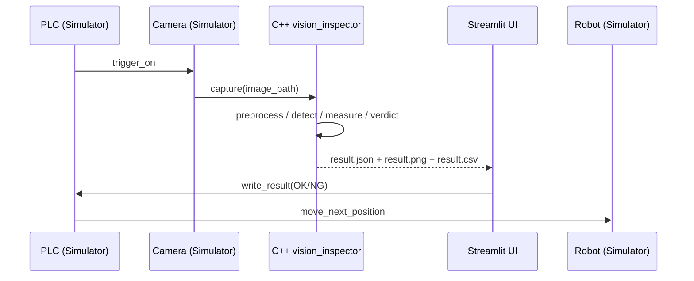

# 시스템 아키텍처

본 POC는 실제 머신비전 검사 설비의 흐름을 다음과 같이 단순화해서 재현한다.

```
┌─────────────┐   trigger   ┌─────────────┐   capture   ┌──────────────────┐
│     PLC     │ ──────────► │   Camera    │ ──────────► │  C++ Inspector   │
│ (Simulator) │             │ (Simulator) │   image     │  vision_inspector│
└─────┬───────┘             └─────────────┘             └────────┬─────────┘
      │ result(OK/NG)                                            │ JSON/PNG/CSV
      ▼                                                          ▼
┌─────────────┐   move_next                              ┌──────────────────┐
│    Robot    │ ◄─────────────────────────────────────── │   Streamlit UI   │
│ (Simulator) │                                          │   (Result View)  │
└─────────────┘                                          └──────────────────┘
```



## 레이어 분리

| 레이어 | 구현 언어 | 역할 |
| --- | --- | --- |
| Core Inspection Engine | **C++ / OpenCV** | 이미지 전처리, 룰베이스 결함 검출, 측정, 판정, 리포트 저장 |
| Equipment Simulators | Python | PLC / Camera / Robot 상태 흐름 시뮬레이션 |
| Sequence Controller | Python | PLC → Camera → C++ → PLC → Robot 시퀀스 오케스트레이션 |
| UI | Python (Streamlit) | 파라미터 조정, 결과 시각화, 결함 테이블 |

핵심 검사 로직은 **반드시 C++** 쪽에 있고, Python은 어떤 OpenCV 호출도 검사 목적으로 수행하지 않는다.
Python의 OpenCV 사용은 오직 “샘플 이미지 합성”과 “테스트용 더미 프레임 작성”에 한정된다.

## 데이터 흐름

1. PLC가 `trigger_on()`을 발행한다.
2. Camera는 ``data/sample_images/<file>.png``를 “캡처한 프레임”으로 반환한다.
3. Sequence Controller가 `scripts/run_cpp_inspector.py`의 래퍼를 통해 `vision_inspector` 바이너리를 subprocess로 호출한다.
4. C++ 엔진이 결과 JSON / 결과 이미지 / 누적 CSV를 ``data/results/``에 기록한다.
5. Python 측은 JSON만 다시 읽어 화면에 표시하고, PLC/Robot 시뮬레이터에 결과를 전달한다.
